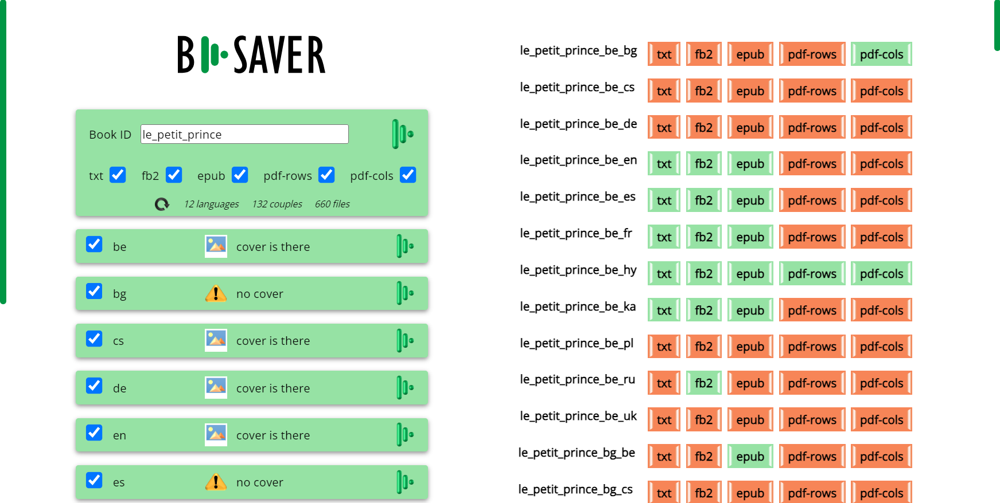

# B-Saver

Browser-based tool for the parallel converting several aligned texts to TXT, FB2, EPUB and PDF formats.

## Usage

1. Clone this repository.

2. Clone the [Bilingual formats](https://github.com/bilinguator/bilingual-formats) and [Print Bilingual PDF](https://github.com/bilinguator/print-bilingual-pdf) repositories to the root directory of this repository.
3. Copy your aligned TXT files to the [books](books) directory. Make sure they face the [specification](https://github.com/bilinguator/aligned-texts#aligned-text-files-specification) requirements.
The following scheme of naming your files is required:

`<BOOK_ID>_<LANG>.txt`, where

* `<BOOK_ID>` is a unique identifier of your book;
* `<LANG>` — ISO code of the language.

4. If applicable, put the PNG covers of your book to the [books/covers](books/covers) directory. Name each cover file as `<LANG>.png`, where `<LANG>` — ISO code of the first language in the language couple. Example: name the cover for the French-Czech version of your book as `fr.png`

5. If applicable, put your PNG illustrations to the [books/illustrations](books/illustrations) directory. Name them as natural Arabic numbers starting from 1 like [here](https://github.com/bilinguator/bilingual-formats/tree/main/tests/img).

6. Launch the web server and open [index.php](index.php) in your browser. Two sided working area will appear.

7. In the left side menu, the `Book ID` textarea contains the book ID of your book determined by file names. If the [books](books) folder contains texts with different IDs, feel free to specify the ID of your interest. In this case, press the `Update` button  to update the interface.

8. Check the checkboxes under the `Book ID` textarea to choose in what formats books has to be saved: txt, fb2, epub, pdf-cols (with parallel columns) or pdf-rows (with alternating paragraphs).

9. Under the formats checkboxes, the information on how many languages, language couples and files are presented.

10. For each language file, a green panel is presented. The message * cover is there* shows the existence of the cover file for a particular language in the [books/covers](books/covers) directory. If no cover found for a language, message is * no cover*.

11. **To save a bilingual version of your book in two languages**, find the line in the right menu starting with the file name looking as

`<BOOK_ID>_<LANG1>_<LANG2>`, where

* `<BOOK_ID>` is a unique identifier of your book;
* `<LANG1>` — ISO code of the language 1;
* `<LANG2>` — ISO code of the language 2.

Click the red button with the interesting format. In case of TXT, FB2, and EPUB formats, the book is saved to the [books/saved](books/saved) directory. When saved, the corresponding button becomes green.

In case of PDF buttons, a printable window is opened according to the operation of the [Print Bilingual PDF](https://github.com/bilinguator/print-bilingual-pdf) tool. The title of the window becomes the file name when printing. Save your printed PDF file to the [books/saved](books/saved) directory and update B-Saver, red button to become green.

12. Click the `<BOOK_ID>_<LANG1>_<LANG2>` title to save and print the book in the two specified languages in all showed formats.

13. Check the checkboxes of the languages in the left menu to change the contents of the right menu. Only the language couples containing one or two out of the checked languages are showed. Example: you have aligned texts in `fr`, `de` and `pl` languages. When only `pl` language checked out of the three, the next language couples are showed: `fr-pl`, `de-pl`, `pl-fr` and `pl-de`.

14. Press the `Launch` button  in one of the language panels to save all the versions of the book in all showed file formats where this is the first language.

15. Press the main `Launch` button  near the `Book ID` textarea to save your book in all chosen language couples and all showed file formats.

 **Alarm!** In case of many languages, file formats and big files, browser may fail.

 **Notice.** Some browsers, such as Google Chrome, may prohibit pop-up windows that are necessary for printing PDFs. Go to settings to allow pop-ups.